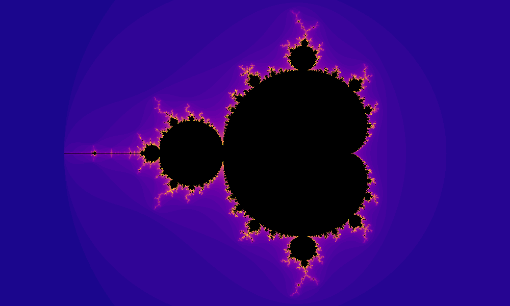

# Mandelbrot Set Generator



## Description

This repository contains a Julia program that generates static images of the Mandelbrot Set, a fascinating fractal. The program allows you to explore and visualize the beauty of the Mandelbrot Set by generating static images in different colorways.

**NOTE:** It is planned to include a zoom-function to explore the fractal in depth in further versions of this program. By now, it only generates static images.

## How the Mandelbrot Set is Calculated and Colored

The Mandelbrot Set is defined using an iterative process. For each point in the complex plane, the program repeatedly applies a mathematical formula:

z_{n+1} = z_{n}^2 + c

Where:
- `z_n` is an initial complex number (usually starting at 0).
- `c` is the complex number corresponding to the point being tested.

The program iterates this formula until one of two conditions is met:
1. The absolute value of `z_n` becomes larger than a predefined threshold (e.g., 3), indicating that the point is likely *not* in the Mandelbrot Set, and the iteration is terminated. => Points are colored based on how many iterations we need to exceed the threshold (colormap).
2. The maximum number of iterations is reached without `z_n` exceeding the threshold, in which case the point is assumed to be in the Mandelbrot Set. => Points turn black.

For further information, refer to: [Mandelbrot Universität Leipzig]([https://link-url-here.org](https://www.informatik.uni-leipzig.de/~meiler/Schuelerseiten.dir/DPlotzki/html/mndlbrt.htm))

## How the Code Works

The code in this repository utilizes the Julia language to perform the following steps:
- Define a range of complex numbers in the complex plane to create an image.
- For each complex number, apply the Mandelbrot Set calculation with a maximum number of iterations.
- Based on the number of iterations required for divergence, assign colors to the corresponding points.
- Save the resulting image as a bitmap (BMP) file.

The color assignment is done using a color map, where the number of iterations determines the color of each point. The exact colors and color scheme can be customized based on preferences.

## Installation

To run this project, you'll need to have Julia installed on your computer. If you don't have Julia installed, you can download it from the official [Julia website](https://julialang.org/downloads/).

Follow these steps to install and run the project:

1. Clone this repository to your local machine:

   ```
   bash
   git clone https://github.com/your-username/mandelbrot-set-generator.git
   ```
2. Navigate to the project directory:

```
cd mandelbrot-set-generator
```

3. Install the required Julia packages by running the following commands within the Julia REPL (enter "]" to activate package manager mode):

```
using Pkg
Pkg.activate(".")
Pkg.instantiate()
```

4. Run the Mandelbrot Set generator:

```
include("MandelbrotZoom.jl")  # Replace with the actual name of your Julia script
```

5. The generated Mandelbrot Set image will be saved as **mandelbrot_set_nozoom.bmp**.

## Acknowledgements

Got my code inspiration from opensources (YT) explanation of the Mandelbrot code in Julia: [opersources YouTube Channel](https://www.youtube.com/watch?v=xVLxTk3SqsA)

Got the idea for Zooming and how I might do it from Alex Carney (YT) who explains it for P5.js: [Alex Carney YouTube Channel](https://www.youtube.com/watch?v=ixFCsST2pF4)

TY :-)

